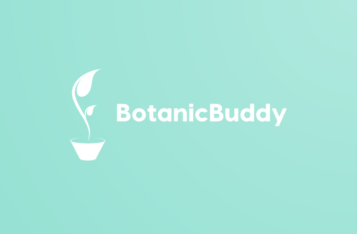

<!-- PROJECT SHIELDS -->
<!--
*** I'm using markdown "reference style" links for readability.
*** Reference links are enclosed in brackets [ ] instead of parentheses ( ).
*** See the bottom of this document for the declaration of the reference variables
*** for contributors-url, forks-url, etc. This is an optional, concise syntax you may use.
*** https://www.markdownguide.org/basic-syntax/#reference-style-links
-->
[![Contributors][contributors-shield]][contributors-url]
[![Forks][forks-shield]][forks-url]
[![Stargazers][stars-shield]][stars-url]
[![Issues][issues-shield]][issues-url]
[![MIT License][license-shield]][license-url]
[![LinkedIn][linkedin-shield]][linkedin-url]

<!-- PROJECT LOGO -->
 

  

<h3 align="center">Botanic Buddy</h3>

  

    Grow with love and technology.
     
    <a href="https://www.youtube.com/watch?v=yVCV0rzNYgQ"><strong>Demo Video Link! »</strong></a>
    <a href="https://www.tinkercad.com/things/9jBVNDOsa2Q"><strong>Tinkercad Simulation </strong></a>
     
     
    <a href="https://devpost.com/software/plantpal">Devpost Link</a>
    .
    <a href="https://github.com/arncv/BotanicBuddy/issues">Request Bug</a>
  

## Inspiration
As plant enthusiasts, we often struggle with providing the right amount of care for our plants. Sometimes we forget to water them, or we don't know when they need more sunlight. That's why we came up with the idea of the  Botanic Buddy, a device that helps monitor the health of our plants and alerts us when they need attention.

## What it does
The  Botanic Buddy is a hardware device that measures three key environmental factors that affect plant growth: moisture, temperature, and light. It uses sensors to detect the levels of each factor and displays them on an LCD screen. Additionally, it alerts us through a buzzer and DC motor when the moisture level drops below a certain threshold.

## How we built it
We built the Botanic Buddy using an Arduino Uno board, a moisture sensor, a temperature sensor, a light sensor, an LCD screen, a buzzer, and a DC motor. We wrote the code in C++ using the Arduino IDE.

## Challenges we ran into
Learned things from scratch.

## Accomplishments that we're proud of
We're proud of successfully building a device that can help us monitor and care for our plants. We also added the unique feature of using a DC motor to automatically turn off when the moisture level drops, which can help save water.

## What we learned
Through this project, we learned a lot about working with sensors and how to integrate various components into a single device. We also learned about the importance of calibrating sensors for accurate readings.

## What's next for Botanic Buddy
In the future, we plan to add connectivity to the device so that it can send notifications to our smartphones. We also want to explore the possibility of adding more sensors to measure additional factors that affect plant growth, such as air quality and humidity.

See the [open issues](https://github.com/arncv/BotanicBuddy/issues) for a full list of proposed features (and known issues).

(<a href="#readme-top">back to top</a>)

<!-- CONTRIBUTING -->
## Contributing

Contributions are what make the open source community such an amazing place to learn, inspire, and create. Any contributions you make are **greatly appreciated**.

If you have a suggestion that would make this better, please fork the repo and create a pull request. You can also simply open an issue with the tag "enhancement".
Don't forget to give the project a star! Thanks again!

1. Fork the Project
2. Create your Feature Branch (`git checkout -b feature/AmazingFeature`)
3. Commit your Changes (`git commit -m 'Add some AmazingFeature'`)
4. Push to the Branch (`git push origin feature/AmazingFeature`)
5. Open a Pull Request

(<a href="#readme-top">back to top</a>)

<!-- LICENSE -->
## License

Distributed under the MIT License. See `LICENSE` for more information.

(<a href="#readme-top">back to top</a>)

## Our ♥️ Contributors

# FREE & OPEN SOURCE PROJECT - HECK YEAHH!

<!-- MARKDOWN LINKS & IMAGES -->
<!-- https://www.markdownguide.org/basic-syntax/#reference-style-links -->
[contributors-shield]: https://img.shields.io/github/contributors/arncv/BotanicBuddy.svg?style=for-the-badge
[contributors-url]: https://github.com/arncv/BotanicBuddy/graphs/contributors
[forks-shield]: https://img.shields.io/github/forks/arncv/BotanicBuddy.svg?style=for-the-badge
[forks-url]: https://github.com/arncv/BotanicBuddy/network/members
[stars-shield]: https://img.shields.io/github/stars/arncv/BotanicBuddy.svg?style=for-the-badge
[stars-url]:https://github.com/arncv/BotanicBuddy/stargazers
[issues-shield]: https://img.shields.io/github/issues/arncv/BotanicBuddy.svg?style=for-the-badge
[issues-url]: https://github.com/arncv/BotanicBuddy/issues
[license-shield]: https://img.shields.io/github/license/arncv/BotanicBuddy.svg?style=for-the-badge
[license-url]: https://github.com/arncv/BotanicBuddy/blob/master/LICENSE
[linkedin-shield]: https://img.shields.io/badge/-LinkedIn-black.svg?style=for-the-badge&logo=linkedin&colorB=555
[linkedin-url]: https://linkedin.com/in/arnvgl
[product-screenshot]: assets/img/brand/screenshot.png
